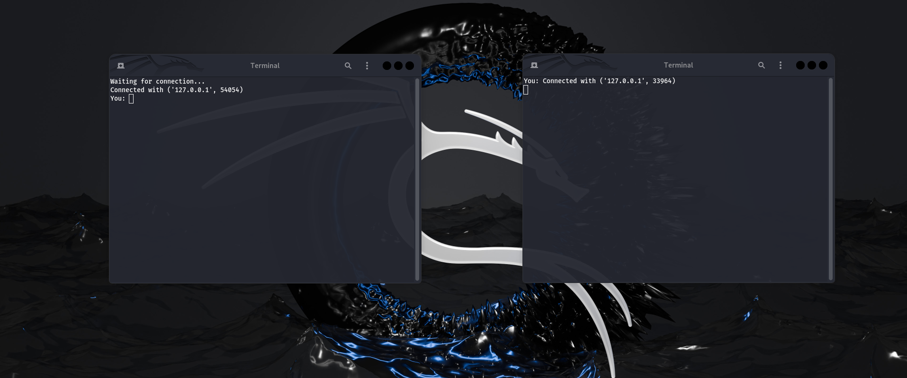
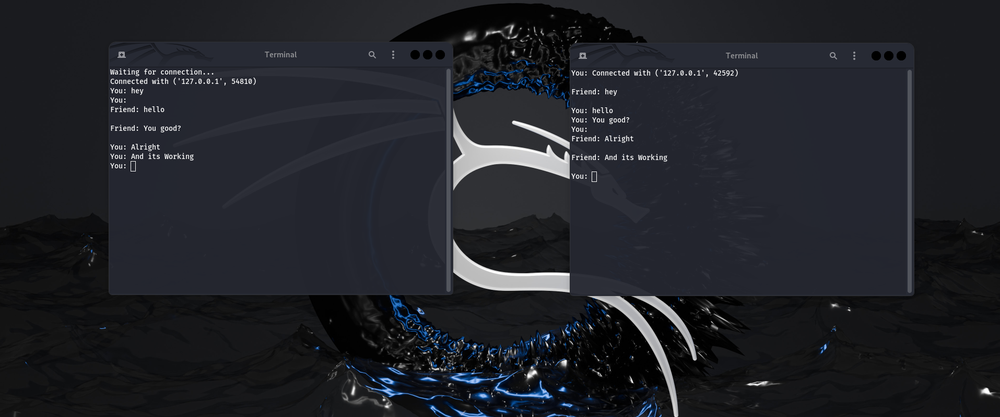

# **Terminal Chat**  

## **Description**  
Terminal Chat is a simple **2 user chat application** that allows two Users to communicate in real-time. Messages are **broadcasted** to all connected users.  

### **Features**  
- two clients chat system  
- Real-time message broadcasting
- Simple and lightweight, runs on **Linux**  


## **Requirements**  
- **Linux** (Any distro)  
- **Python 3.x** installed  


## **Installation & Usage**  

### **Clone the Repository**  
```bash
git clone https://github.com/SirusSnitch/Terminal-Chat-V2.git
cd Terminal-Chat-V2
```

### **Give Execution to Script**  

```bash
chmod +x ./start.sh
```

### **Start the Application**  

```bash
./start.sh
```

## **Screenshots**  

**🟢 Starting State**  
  

**💬 Working Chat Application**  
  

---

## **How It Works**  
1. **Start User 1** → Listens for incoming connections.  
2. **Start User 2** → Users Connect with each other.  
3. **Chat in Real-Time** → Messages are **broadcasted** to all users.  
4. **Type `exit` to leave**

---

## **Customization**  
You can modify the **sending port** and **recieving port** in the `User1.py` and `User2.py` files.

---

## **License**  
This project is open-source and available under the [MIT License](License.txt).